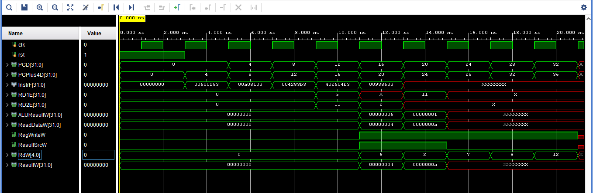
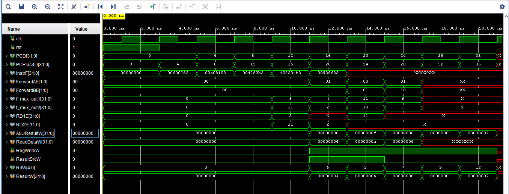

# 🛡️ Pipelined RISC Processor with Hazard Unit

An enhanced version of the 32-bit pipelined RISC processor featuring **data hazard detection and resolution** using forwarding/bypassing techniques.

<p align="center">
  
</p>

---

## 🎯 Problem Solved

In pipelined processors, **data hazards** occur when instructions depend on results from previous instructions still in the pipeline. Without hazard handling, this leads to incorrect results.

### Example Hazard Scenario:
```assembly
lw x5, 6(x0)      # Instruction 1: Load data into x5
add x7, x5, x4    # Instruction 2: Uses x5 (data hazard!)
```

**Without Hazard Unit**: Instruction 2 would use old/incorrect value of x5  
**With Hazard Unit**: Forwards correct value from pipeline registers

---

## 📁 Repository Structure

```
📦 RISC-Processor-Hazard-Unit/
├── 📂 Pipelined_RISC_processor_Hazard_Unit/
│   ├── fetch_cycle_new.v          # Enhanced fetch stage
│   ├── decode_cycle_new.v         # Enhanced decode with hazard detection
│   ├── execute_cycle_new.v        # Enhanced execute with forwarding
│   ├── memory_cycle_new.v         # Enhanced memory stage
│   ├── write_back_cycle_new.v     # Enhanced write-back stage
│   ├── Hazard_unit.v             # Hazard detection & forwarding logic
│   └── pipelining_RISC_top_new.v  # Top module with hazard unit
├── 📂 Result/
│   ├── waveform_without_hazard_unit.png  # Shows incorrect behavior
│   ├── waveform_with_hazard_unit.png     # Shows correct behavior
│   ├── register_file_values.png          # Final register values
│   └── data_memory_values.png            # Memory contents
├── 📂 Supporting_Material/
│   ├── hazard_unit_logic.png             # Hazard detection logic
│   ├── forwarding_or_bypassing_technique.png  # Forwarding implementation
│   └── condition_table.png               # Forwarding conditions
└── block_diagram_with_hazard_unit.png    # Complete architecture
```

---

## ⚡ Hazard Unit Features

### 🔍 **Data Hazard Detection**
- Monitors register dependencies between pipeline stages
- Identifies RAW (Read After Write) hazards
- Generates forwarding control signals

### 🔄 **Forwarding/Bypassing Logic**
- **EX/MEM → EX**: Forward ALU result to next instruction
- **MEM/WB → EX**: Forward memory/ALU result to execute stage
- **Priority handling**: Latest result takes precedence

### 📋 **Forwarding Conditions**
```verilog
// Forward from EX/MEM stage
ForwardAE = ((RegWriteM == 1) && (RdM != 0) && (RdM == Rs1E)) ? 2'b10 :       
            ((RegWriteW == 1) && (RdW != 0) && (RdW == Rs1E)) ? 2'b01 : 2'b00;

// Forward from MEM/WB stage  
ForwardBE = ((RegWriteM == 1) && (RdM != 0) && (RdM == Rs2E)) ? 2'b10 : 
            ((RegWriteW == 1) && (RdW != 0) && (RdW == Rs2E)) ? 2'b01 : 2'b00;
```

---

## 🧪 Test Instructions

The processor is tested with data-dependent instructions:

```assembly
Instruction1: 00600283 (`lw x5, 6(x0)`)     # Load word into x5
Instruction2: 00A08103 (`lw x2, 10(x1)`)   # Load word into x2
Instruction3: 004283B3 (`add x7, x5, x4`)   # RAW hazard: depends on x5
Instruction4: 402504B3 (`sub x9, x10, x2`)  # RAW hazard: depends on x2  
Instruction5: 00938633 (`add x12, x7, x9`)  # RAW hazard: depends on x7 and x9
```

---

## 📊 Results Comparison

<table>
<tr>
<td></td>
<td></td>
</tr>
<tr>
<td align="center"><b>❌ Without Hazard Unit</b><br><i>Incorrect results due to data hazards</i></td>
<td align="center"><b>✅ With Hazard Unit</b><br><i>Correct results with forwarding</i></td>
</tr>
</table>

---

## 🚀 Key Improvements

| Feature | Without Hazard Unit | With Hazard Unit |
|---------|-------------------|------------------|
| **Data Hazard Handling** | ❌ Incorrect results | ✅ Resolved via forwarding |
| **Performance** | Requires stalls/NOPs | Maintains pipeline flow |
| **Correctness** | Fails on dependent instructions | Handles all RAW hazards |
| **Hardware Overhead** | Minimal | Small additional logic |

---

## 💡 Technical Implementation

- **Forwarding Multiplexers**: Added to ALU inputs in execute stage
- **Hazard Detection Logic**: Compares register addresses across pipeline stages  
- **Control Signal Generation**: ForwardA and ForwardB signals control data paths

---


⭐ **This implementation demonstrates advanced pipelining concepts and real-world processor design challenges!**
