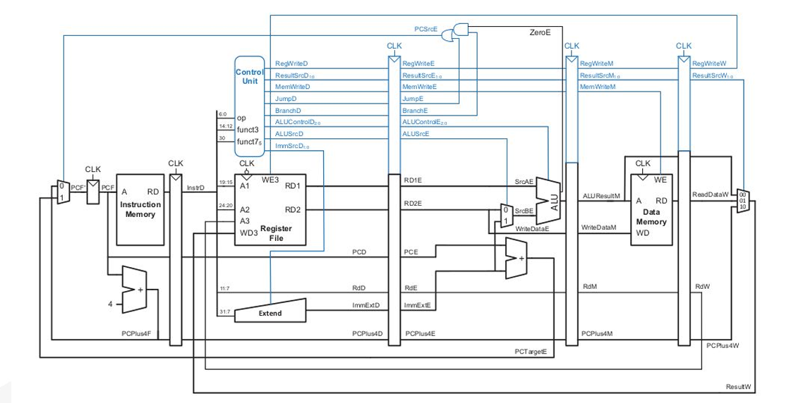
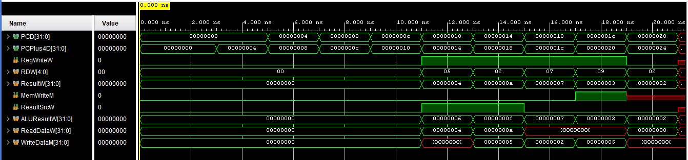
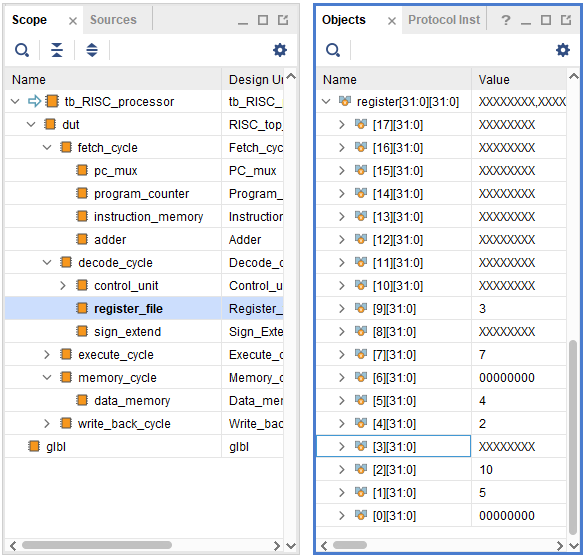
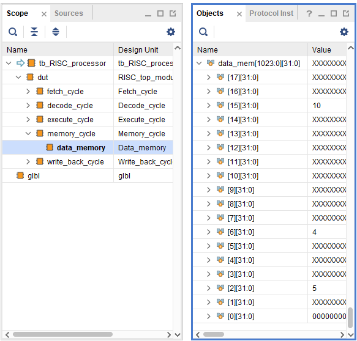

# 🚀 32-bit Pipelined RISC Processor

A complete implementation of a 32-bit pipelined RISC processor designed using Verilog HDL and simulated on Xilinx Vivado. This project demonstrates the fundamentals of computer architecture with a 5-stage pipeline implementation.

<p align="center">
  
</p>

---

## 📋 Project Overview

This project implements a **32-bit pipelined RISC processor** with the classic 5-stage pipeline architecture:

1. **Instruction Fetch (IF)**
2. **Instruction Decode (ID)** 
3. **Execute (EX)**
4. **Memory Access (MEM)**
5. **Write Back (WB)**

The processor supports basic RISC instruction set including arithmetic, logical, memory, and control flow operations.

---

## 📁 Repository Structure

```
📦 32-bit-RISC-Processor/
├── 📂 Pipelined_RISC_processor/
│   ├── Fetch_cycle.v           # Instruction Fetch stage
│   ├── Decode_cycle.v          # Instruction Decode stage  
│   ├── Execute_cycle.v         # Execute stage
│   ├── Memory_cycle.v          # Memory Access stage
│   ├── Write_back_cycle.v      # Write Back stage
│   ├── RISC_top_module.v       # Top-level processor module
│   └── tb_RISC_processor.v     # Testbench for simulation
├── 📂 Result/
│   ├── data_memory_values.png  # Data memory contents
│   ├── register_file_values.png # Register file contents
│   └── result_waveform.png     # Simulation waveforms
├── 📂 Schematic/
│   ├── fetch_cycle.png         # Fetch stage schematic
│   ├── decode_cycle.png        # Decode stage schematic
│   ├── execute_cycle.png       # Execute stage schematic
│   ├── memory_cycle.png        # Memory stage schematic
│   ├── write_back_cycle.png    # Write-back stage schematic
│   └── pipelined_RISC_processor.png # Complete processor schematic
├── 📂 Supporting_Materials/
│   ├── division_of_instructions.png    # Instruction format breakdown
│   ├── control_unit.png               # Control unit signals
│   ├── ALU_control.png               # ALU control signals
│   └── values_stored_in_RF_&_DM.png  # Memory initialization data
└── block_diagram.png           # High-level architecture diagram
```

---

## 🔧 Technical Specifications

- **Architecture**: 32-bit RISC with 5-stage pipeline
- **Word Size**: 32 bits
- **Register File**: 32-bit each
- **Memory**: Instruction and Data memory
- **Pipeline Stages**: IF → ID → EX → MEM → WB
- **HDL**: Verilog
- **Simulation Tool**: Xilinx Vivado

---

## 🔄 Why Pipelining?

### Single-Cycle Processor Limitations

In a **single-cycle processor**, each instruction must complete all five stages before the next instruction can begin:

```
Instruction 1: [IF][ID][EX][MEM][WB]
Instruction 2:                      [IF][ID][EX][MEM][WB]
Instruction 3:                                           [IF][ID][EX][MEM][WB]
```

**Disadvantages of Single-Cycle Design:**
- ⏰ **Lower Throughput**: Only one instruction completes per clock cycle
- 🐌 **Slower Clock Speed**: Clock period determined by slowest stage
- ⚡ **Resource Underutilization**: Most functional units idle during each cycle
- 💰 **Poor Performance**: CPI (Cycles Per Instruction) = 1, but with very long cycles

### Pipelined Processor Advantages

In a **pipelined processor**, multiple instructions execute simultaneously in different stages:

```
Clock: 1    2    3    4    5    6    7    8
Inst1: [IF][ID][EX][MEM][WB]
Inst2:     [IF][ID][EX][MEM][WB]
Inst3:         [IF][ID][EX][MEM][WB]
Inst4:             [IF][ID][EX][MEM][WB]
Inst5:                 [IF][ID][EX][MEM][WB]
```

**Advantages of Pipelined Design:**
- 🚀 **Higher Throughput**: One instruction completes every clock cycle (after initial fill)
- ⚡ **Faster Clock Speed**: Clock period determined by fastest stage
- 🔧 **Better Resource Utilization**: All functional units working simultaneously
- 📈 **Improved Performance**: Up to 5x speedup compared to single-cycle

### Performance Comparison

| Metric | Single-Cycle | Pipelined | Improvement |
|--------|---------------|-----------|-------------|
| **Instructions/sec** | 1 / (5 × stage_delay) | 1 / stage_delay | **5x faster** |
| **Resource Usage** | 20% (1/5 units active) | 100% (all units active) | **5x better** |
| **Latency per instruction** | 5 × stage_delay | 5 × stage_delay | Same |
| **Throughput** | Low | High | **Significantly better** |

---

## 📊 Pipeline Stages

### 1. **Fetch Cycle** (`Fetch_cycle.v`)
- Fetches instructions from instruction memory
- Updates program counter (PC)
- Handles branch/jump target calculations

### 2. **Decode Cycle** (`Decode_cycle.v`)
- Decodes instruction format and operation
- Generates control signals
- Reads operands from register file

### 3. **Execute Cycle** (`Execute_cycle.v`)
- Performs arithmetic and logical operations
- Calculates memory addresses
- Executes branch conditions
- ALU operations with control signals

### 4. **Memory Cycle** (`Memory_cycle.v`)
- Handles load/store operations
- Accesses data memory
- Memory read/write control

### 5. **Write Back Cycle** (`Write_back_cycle.v`)
- Writes results back to register file
- Updates destination registers
- Completes instruction execution

---

## 📊 Instructions exicuted 
- Instruction 1: 00600283 (`lw x5, 6(x0)`)
- Instruction 2: 00A08103 (`lw x2, 10(x1)`)
- Instruction 3: 001203B3 (`add x7 x4 x1`)
- Instruction 4: 404084B3 (`sub x9 x1 x4`)
- Instruction 5: 00100123 (`sw x1, 2(x0)`)

---

## 🔬 Simulation Results

<table>
<tr>
<td></td>
<td></td>
</tr>
<tr>
<td align="center"><b>Simulation Waveforms</b></td>
<td align="center"><b>Register File Contents</b></td>
</tr>
</table>

<p align="center">
  
  <br><b>Data Memory Contents</b>
</p>

---

## 📚 References

- The Morgan Kaufmann Series, "Computer Organization and Design - RISC V EDITION"

---


## 📬 Contact

**Prajwal R**  
📧 Email: rprajwal745@gmail.com  
🔗 LinkedIn: [linkedin.com/in/prajwal~r](https://www.linkedin.com/in/prajwal~r)

---


⭐ **If you find this project helpful, please give it a star!**

