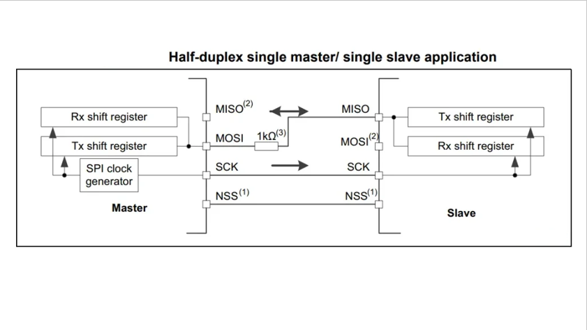
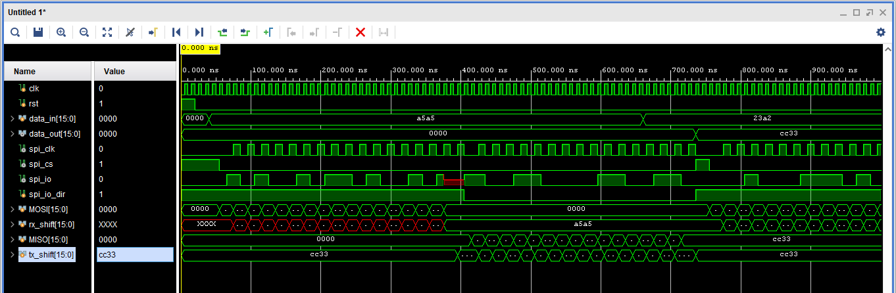

# 📡 SPI Protocol - Half Duplex Mode

A Verilog implementation of the **Serial Peripheral Interface (SPI)** protocol operating in **half-duplex mode**. This project demonstrates master-slave communication using a synchronous serial communication protocol widely used in embedded systems.

<p align="center">
  
</p>

---

## 📋 Overview

**SPI (Serial Peripheral Interface)** is a synchronous serial communication protocol used for short-distance communication between microcontrollers and peripheral devices. This implementation features:

- ✅ Master-Slave architecture
- ✅ Half-duplex communication (unidirectional data transfer)
- ✅ Clock-driven synchronous data transfer
- ✅ Configurable data width
- ✅ Complete simulation testbench

---

## 🔌 What is Half Duplex?

In **half-duplex mode**, data flows in **one direction at a time**:
- Master → Slave (transmission phase)
- OR Slave → Master (reception phase)
- **Not simultaneous** (unlike full-duplex)

This mode is useful when:
- Bidirectional communication isn't needed simultaneously
- Reducing pin count is important
- Simpler control logic is preferred

---

## 📁 Repository Structure

```
📦 SPI_Protocol_Half_Duplex/
├── spi_master.v         # Master module with clock generation
├── spi_slave.v          # Slave module with data handling
├── spi_top.v            # Top module connecting master & slave
├── spi_tb.v             # Testbench for simulation
├── block_diagram.png    # System architecture diagram
└── waveform.png         # Simulation waveform results
```

---

## 🔧 SPI Signal Lines

| Signal | Direction | Description |
|--------|-----------|-------------|
| **SCLK** | Master → Slave | Serial Clock generated by master |
| **MOSI** | Master → Slave | Master Out Slave In (data line) |
| **MISO** | Slave → Master | Master In Slave Out (data line) |
| **CS/SS** | Master → Slave | Chip Select / Slave Select (active low) |

**Note**: In half-duplex mode, either MOSI or MISO is active at any given time, not both.

---

## 🎯 Module Descriptions

### 📤 **SPI Master** (`spi_master.v`)
- Generates serial clock (SCLK)
- Controls chip select (CS) signal
- Transmits data serially via MOSI
- Receives data from MISO
- Manages communication timing

### 📥 **SPI Slave** (`spi_slave.v`)
- Receives serial clock from master
- Captures data on MOSI line
- Transmits data on MISO line
- Responds when CS is asserted
- Shifts data in/out based on clock edges

### 🔗 **SPI Top Module** (`spi_top.v`)
- Integrates master and slave modules
- Establishes communication links
- Routes all SPI signals
- Acts as system-level wrapper

### 🧪 **Testbench** (`spi_tb.v`)
- Verifies master-slave communication
- Tests data transmission accuracy
- Validates timing requirements
- Generates simulation waveforms

---

## 📊 Simulation Results

<p align="center">
  
</p>

The waveform demonstrates:
- ✅ Proper clock generation
- ✅ Chip select assertion/deassertion
- ✅ Serial data transmission on MOSI/MISO
- ✅ Correct data capture timing
- ✅ Half-duplex operation

---

## 🚀 How to Run

### Prerequisites
- Xilinx Vivado / ModelSim / any Verilog simulator
- Basic understanding of SPI protocol

### Simulation Steps

1. **Clone the repository**:
   ```bash
   git clone https://github.com/YOUR_USERNAME/SPI-Protocol-Half-Duplex.git
   cd SPI-Protocol-Half-Duplex
   ```

2. **Open your Verilog simulator**

3. **Add source files**:
   - Add `spi_master.v`, `spi_slave.v`, `spi_top.v`
   - Set `spi_top.v` as top module
   - Add `spi_tb.v` as simulation source

4. **Run simulation**:
   ```bash
   # For Vivado
   Run Behavioral Simulation
   
   # For ModelSim
   vlog spi_master.v spi_slave.v spi_top.v spi_tb.v
   vsim spi_tb
   run -all
   ```

5. **Analyze waveforms** to verify correct operation

---

## ⚙️ Key Features

- 🔄 **Configurable Data Width**: Easy to modify for 8-bit, 16-bit, or 32-bit transfers
- ⏱️ **Clock Control**: Master generates and controls serial clock
- 🎚️ **Active Low CS**: Standard chip select implementation
- 📊 **Edge Triggered**: Data capture on clock edges
- 🧪 **Fully Tested**: Complete testbench with verification

---

## 🎓 Learning Outcomes

Through this project, you'll understand:
- Serial communication protocols
- Master-slave synchronous communication
- Clock-driven data transfer
- Half-duplex vs full-duplex modes
- Verilog implementation of communication protocols
- Timing and synchronization in digital systems

---

## 🔮 Future Enhancements

- [ ] Add full-duplex mode support
- [ ] Implement multiple slave select capability
- [ ] Add configurable clock polarity (CPOL) and phase (CPHA)
- [ ] Error detection and handling
- [ ] FIFO buffers for data management
- [ ] Different SPI modes (Mode 0, 1, 2, 3)

---

## 📚 References

- SPI Protocol Specification
- Embedded Systems Communication Protocols
- Verilog HDL Design Guidelines

---

## 📬 Contact

**Prajwal R**  
📧 Email: rprajwal745@gmail.com  
🔗 LinkedIn: [linkedin.com/in/prajwal~r](https://www.linkedin.com/in/prajwal~r)

---

⭐ **If you find this project useful, please give it a star!**